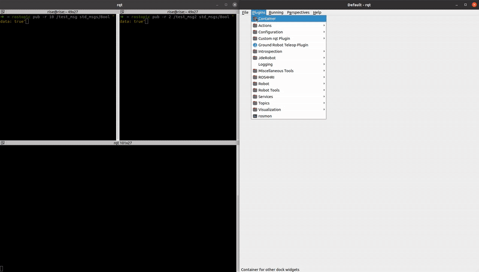

# rqt-custom-plugin
- rqt custom plugin is a collection of custom RQT plugins for the Robot Operating System (ROS).
- Currently, it includes the rqt_heartbeat_checker plugin, which monitors heartbeat signals from a specific topic to check system status. 
- More plugins will be added in the future.

<div align="center">
  <table>
    <tr>
      <td align="center">
        
        <br><b>Heart Beat Checker</b>
      </td>
    </tr>
  </table>
</div>

# Installation
## Prerequisites
- ROS 1 (Noetic, Melodic, etc.)
- Python 3.8 or later
- rqt and related dependencies

## Install
```bash
cd ~/catkin_ws/src
git clone https://github.com/HJS-HJS/rqt-custom-plugin.git
cd ~/catkin_ws
catkin_make
source devel/setup.bash
```

## Usage
### Heart Beat Checker
```bash
rqt -s HeartBeatPlugin
```
- Alternatively, you can launch RQT and select the plugin from __Plugins -> Custom rqt Plugin -> rqt_heartbeat_checker__.



# Features
## rqt_heartbeat_checker
- Detects and monitors heartbeat signals from a specified ROS topic.
- Provides a user-friendly GUI.
- Displays real-time heartbeat status using a widget.
- Supports customizable styles via qlabel_style.py.

# Future Plans
- Additional RQT plugins will be included in this repository.
- The structure will be maintained to support multiple plugins under rqt_custom_plugin.